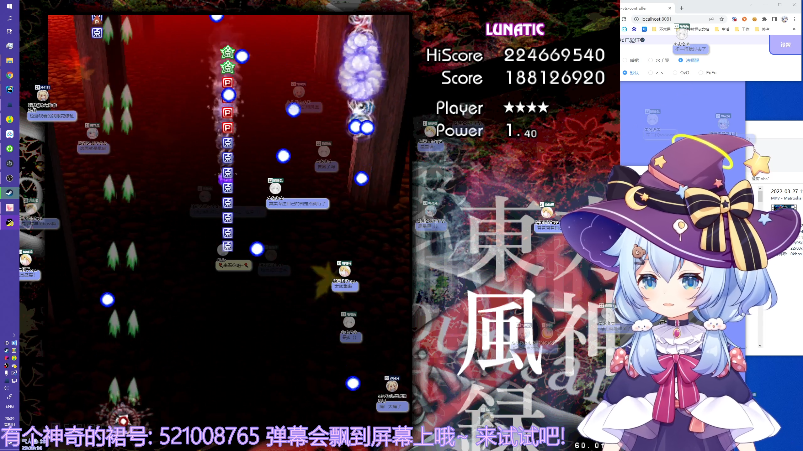

# Cloudar弹幕
> 本文档为使用指南, 开发指南请前往[DEVREADME.md](./DEVREADME.md)  

> 目前只打包了windows版本, mac版本有需求的话后续会再打包 (需要去借一个mac(噗))    

> Cloudar = Cloud + Sugar  
> 云朵糖弹幕  

## 安装
前往本项目[Release页](https://github.com/qri-projects/cloudar-electron/releases), 下载最新版安装包或者免安装版  

## 配置
下载/安装软件之后, 要前往配置文件更改房间号  
配置文件在软件目录下的```resources/extraResources/config.json```文件  

## 效果预览
图片里屏幕上漂浮的弹幕泡泡就是观众发的弹幕. 漂浮显示在主播屏幕上, 通过OBS捕捉桌面源获取  
  

## 后续支持的功能
- 支持biliChat主题  
- 完善窗口大小调节功能  
  现在只能全屏覆盖, 不能调节窗口大小
- 给这个项目弄个logo