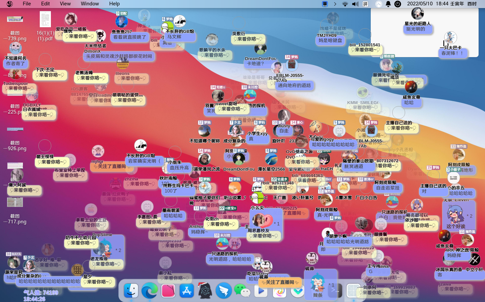

# Cloudar弹幕
> 本文档为使用指南, 开发指南请前往[DEVREADME.md](./DEVREADME.md)  

> 建议自己动手从qri的仓库中自行编译，不算太难；本打包程序不稳定，不保证在所有发行版中都能正常运行。

> Cloudar = Cloud + Sugar  
> 云朵糖弹幕  

## 安装
前往本项目[Release页](https://github.com/defaultuser-0/cloudar-electron-linux/releases), 下载最新版本  

## 配置
下载/安装软件之后, 要前往配置文件更改房间号  
配置文件在软件目录下的```resources/extraResources/config.json```文件  
对于debian系用户，在确保安装了nano后，可以通过打开启动器上的“cloudar-electron”或者终端运行”cloudar-electron“进行配置  

## 效果预览
图片里屏幕上漂浮的弹幕泡泡就是观众发的弹幕. 漂浮显示在主播屏幕上, 通过OBS捕捉桌面源获取，约5分钟消失。  
  
原作者截图示意
  
以其他直播间仅弹幕示意
## 后续支持的功能
- 支持biliChat主题  
- 完善窗口大小调节功能  
  现在只能全屏覆盖, 不能调节窗口大小  
- 给这个项目弄个logo（为了体面点用了别的软件的图标（特指deb包里面的（  
- 弹幕数量上限  
  防止遮挡屏幕  
- 全局不透明度  
  防止弹幕出现速度过快(一瞬铺满屏幕)的情况下遮挡屏幕  
